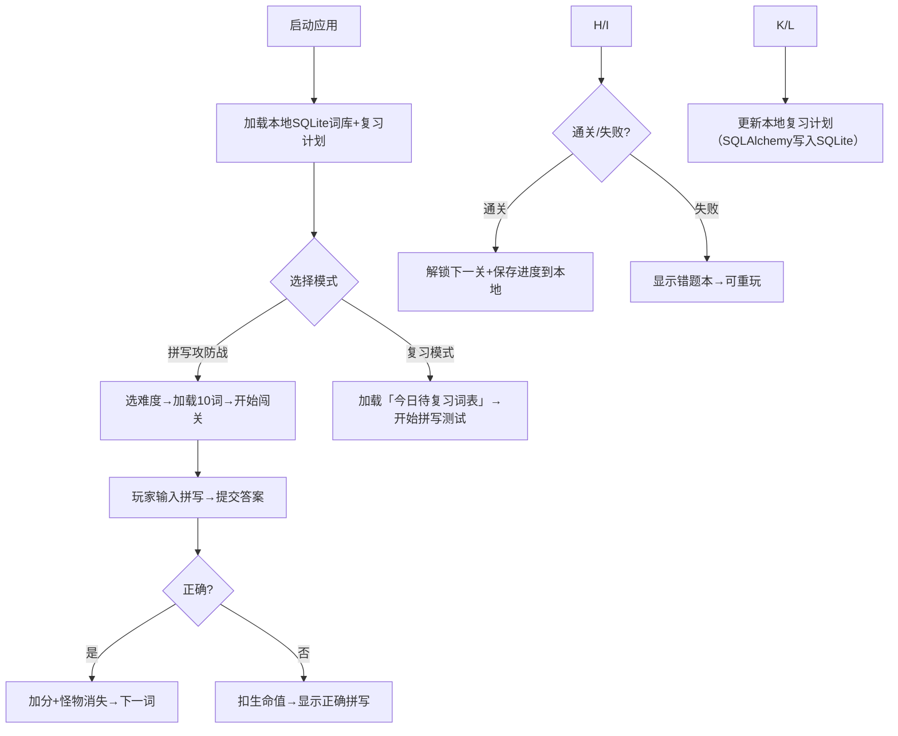

### **WordEasy 简化版需求文档（拼写玩法专版）**  

> ✅ **开发状态：已完成核心功能** - 详细使用说明请查看 [PROJECT_README.md](./PROJECT_README.md)

**核心目标**：聚焦「拼写攻防战」玩法，结合科学记忆法（遗忘曲线），通过本地存储实现轻量化英语学习工具  
**技术栈**：  
- 前端：Vue 3 (Composition API) + Pinia（本地状态管理）+ Vue Router + Tailwind CSS  
- 后端：Python FastAPI（轻量API服务）+ SQLAlchemy（SQLite适配）  
- 数据库：SQLite（单文件本地存储，无需独立服务器）

---

## 🚀 快速启动

### 方式1：使用启动脚本（推荐）
```powershell
# 在项目根目录执行
.\start.ps1
```

### 方式2：分别启动后端和前端
```powershell
# 后端
cd backend
.\start_backend.ps1

# 前端（新窗口）
cd frontend
.\start_frontend.ps1
```

启动后访问：http://localhost:5173

---  


### **一、核心功能模块**  
#### 1. **拼写玩法：拼写攻防战**（唯一核心玩法）  
- **基础规则**  
  - 玩家扮演“单词守护者”，抵御“错误拼写怪”进攻  
  - 系统播放单词发音（可选）+ 显示中文释义，玩家输入英文拼写  
  - 正确：消灭怪物，获得积分；错误：扣1点生命值（初始3点）  
  - 关卡制：每关10个单词，限时90秒，通关后解锁下一关（难度递增）  

- **难度分级**  
  | 难度 | 单词特点                | 干扰项设计               |  
  |------|-------------------------|--------------------------|  
  | 初级 | 短单词（3-5字母）、常见词 | 字母顺序颠倒（如“tac”→cat） |  
  | 中级 | 长单词（6-8字母）、短语  | 近音词替换（如“affect”→effect） |  
  | 高级 | 多音节词、易混词        | 漏写/多写字母（如“environment”→enviroment） |  

- **视觉反馈**  
  - 正确：绿色对勾+积分动画；错误：红色叉号+怪物前进一格  
  - 通关：显示“拼写大师”徽章+本关正确率  


#### 2. **智能记忆引擎**（本地化实现）  
- **动态复习算法**（基于遗忘曲线，本地存储复习计划）  
  - 单词掌握度标记：`陌生(🔴)`→`熟悉(🟡)`→`掌握(🟢)`（本地Pinia存储）  
  - 自动复习触发：  
    - 陌生词：当天复习3次（间隔1h/3h/6h）  
    - 熟悉词：次日复习1次，之后按3天/7天/15天间隔  
    - 掌握词：每周随机抽查1次  
  - 每日推送：本地生成「今日待复习词表」（≤20词）  

- **拼写测试模式**（仅保留拼写相关）  
  | 子模式       | 规则                          |  
  |--------------|-------------------------------|  
  | 速拼挑战     | 10词限时60秒，按正确数计分    |  
  | 错词歼灭战   | 仅练习历史错误拼写词          |  


#### 3. **轻量化词库管理**（本地导入+分类）  
- **内置词库**（默认包含3类，共300词）  
  - 日常高频（100词）：hello, apple, happy...  
  - 考试核心（100词）：analyze, benefit, challenge...  
  - 兴趣主题（100词）：动物/食物/科技分类词  

- **自定义词库**  
  - 支持上传TXT文件（每行1词+中文释义，用“|”分隔，如“abandon|放弃”）  
  - 自动去重+校验格式，生成个人词库  


### **二、关键业务流程（无登录版）**  



### **三、API 设计规范（FastAPI + SQLite）**  
| 端点                  | 方法 | 参数                          | 响应示例                                  |  
|-----------------------|------|-------------------------------|-------------------------------------------|  
| `/api/words`           | GET  | `difficulty=1`（难度1-3）      | `[{"id":1,"word":"cat","zh":"猫",...}]`   |  
| `/api/words/upload`    | POST | `file: txt文件`               | `{"status":"success","count":50}`         |  
| `/api/spell/check`     | POST | `{"word_id":1,"input":"cat"}`  | `{"correct":true,"next_review":"2024-06-20"}` |  
| `/api/progress`        | GET  | -                             | `{"level":3,"coins":150,"mastery":{"红":5}}` |  


### **四、数据库设计（SQLite）**  
仅需2张核心表（单文件存储，路径`./data/wordeasy.db`）：  

```sql
-- 单词表（内置+自定义词库共用）
CREATE TABLE words (
  id INTEGER PRIMARY KEY AUTOINCREMENT,
  word TEXT NOT NULL UNIQUE,  -- 英文单词
  zh_definition TEXT NOT NULL,  -- 中文释义
  difficulty TINYINT CHECK(difficulty BETWEEN 1 AND 3),  -- 1初级/2中级/3高级
  category TEXT,  -- 分类（日常/考试/动物等）
  audio_url TEXT  -- 发音音频URL（可选，用免费TTS生成）
);

-- 本地学习进度表（无用户ID，单用户本地存储）
CREATE TABLE progress (
  word_id INTEGER PRIMARY KEY REFERENCES words(id),
  mastery_level TINYINT DEFAULT 0,  -- 0陌生/1熟悉/2掌握
  next_review DATE,  -- 下次复习日期（YYYY-MM-DD）
  error_count INTEGER DEFAULT 0  -- 错误次数（用于错词歼灭战）
);
```


### **五、非功能性需求**  
1. **轻量化**  
   - 前端包体积＜500KB（Tailwind按需引入）  
   - 后端单文件运行（FastAPI+SQLite，无需额外服务）  

2. **本地优先**  
   - 所有数据（词库/进度/设置）存本地SQLite，无云端同步  
   - 支持离线使用（除发音外，音频可预缓存）  

3. **易用性**  
   - 界面极简：仅保留「开始闯关」「复习模式」「词库管理」3个入口  
   - 错误提示清晰：拼写错误时标红差异字母（如输入“cta”→正确“cat”，标红“c**t**a”）  


### **六、开发里程碑（简化版）**  
| 阶段   | 周期   | 交付物                          |  
|--------|--------|---------------------------------|  
| 原型期 | 1周    | Vue静态页面（拼写界面+进度条）  |  
| Alpha  | 2周    | 核心拼写逻辑+SQLite词库/进度表  |  
| Beta   | 1周    | 难度分级+复习算法+TXT导入功能   |  
| 上线   | 0.5周  | 打包为桌面端（Electron可选）+ 单文件SQLite |  


### **七、交付说明**  
1. **优先实现**：拼写攻防战（含难度分级）+ 本地复习算法（SQLite存储进度）  
2. **简化点**：无登录/无社交/无复杂游戏化（仅保留积分+徽章激励）  
3. **开发提示**：Claude Sonnet 4.5 可直接生成：  
   - Vue组件：`SpellGame.vue`（拼写界面）、`WordList.vue`（词库管理）  
   - FastAPI接口：`/api/words`（查词）、`/api/spell/check`（校验拼写）  
   - SQLite初始化脚本（含内置300词）  

> 此版本极致简化，专注拼写核心体验，适合快速开发验证。